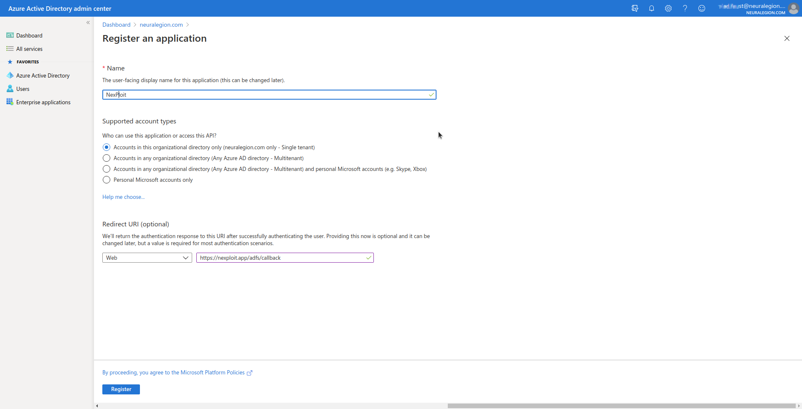
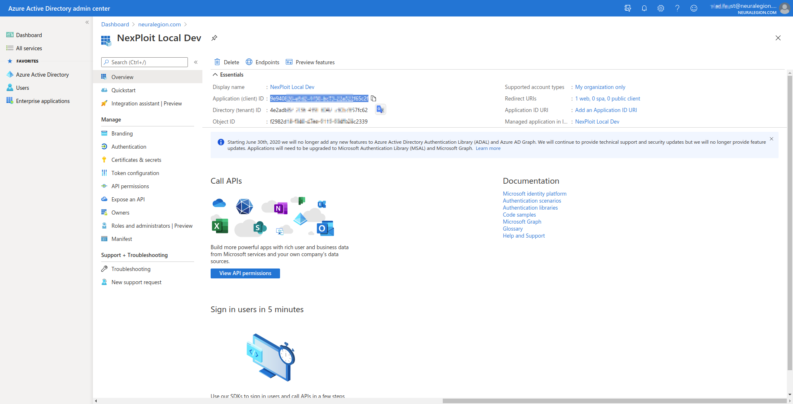
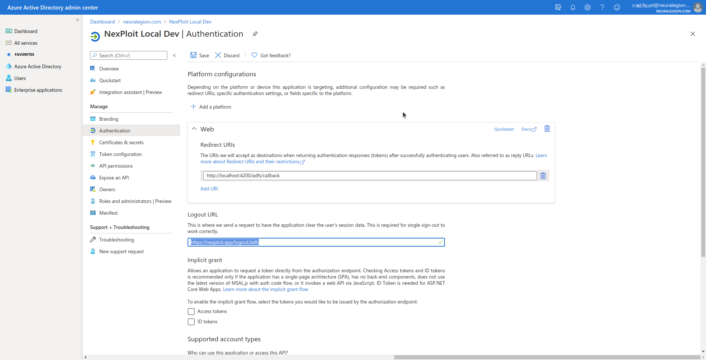
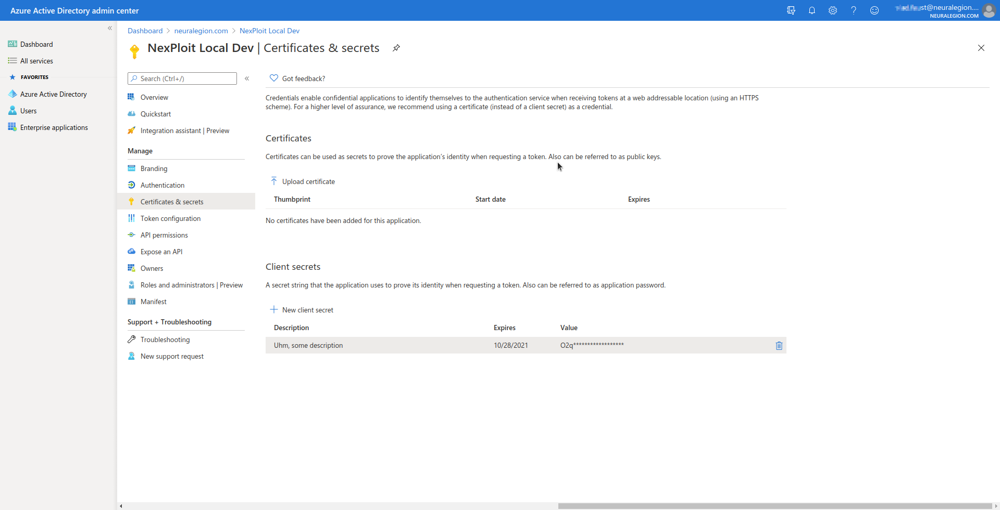
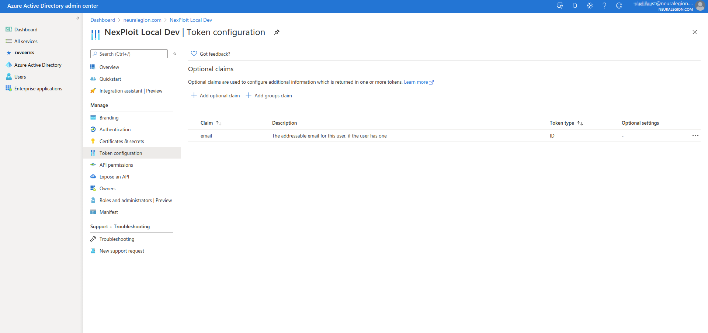

# Azure Active Directory SSO
To configure an Azure Active Directory SSO integration, an admin shall:
1. Add an app in the "App registrations" section. Set the callback URL to `https://nexploit.app/adfs/callback`:\

    * Copy-paste the Application (client) ID into NexPloit client akin to Okta:\
    
    * Open the "Endpoints" tab and copy-paste the OpenID Connect metadata document endpoint value (`https://login.microsoftonline.com/4e2adb87-2f36-439f-8047-a30b7857fc62/v2.0/.well-known/openid-configuration` on the screenshot) into NexPloit client as _Metadata URL_ akin to Okta:\
    
2. In the "Authentication" tab, set _Logout URL_ to `https://nexploit.app/logout/adfs`:\

3. Add a client secret in the "Certificates & secrets" tab and copy its value to NexPlout client akin to Okta:\

4. Manually add `email`, `offline_access`, `openid` and `profile` permissions in the "API permissions" tab:\

5. Add `email` claim to the **ID** token:\

6. **Manually** set `Email` fields (look up for `vl*******@neuralegion.com` on the screenshot) in the "Users" interface for each user. It is **not** set by default by AAD and required for login to work.